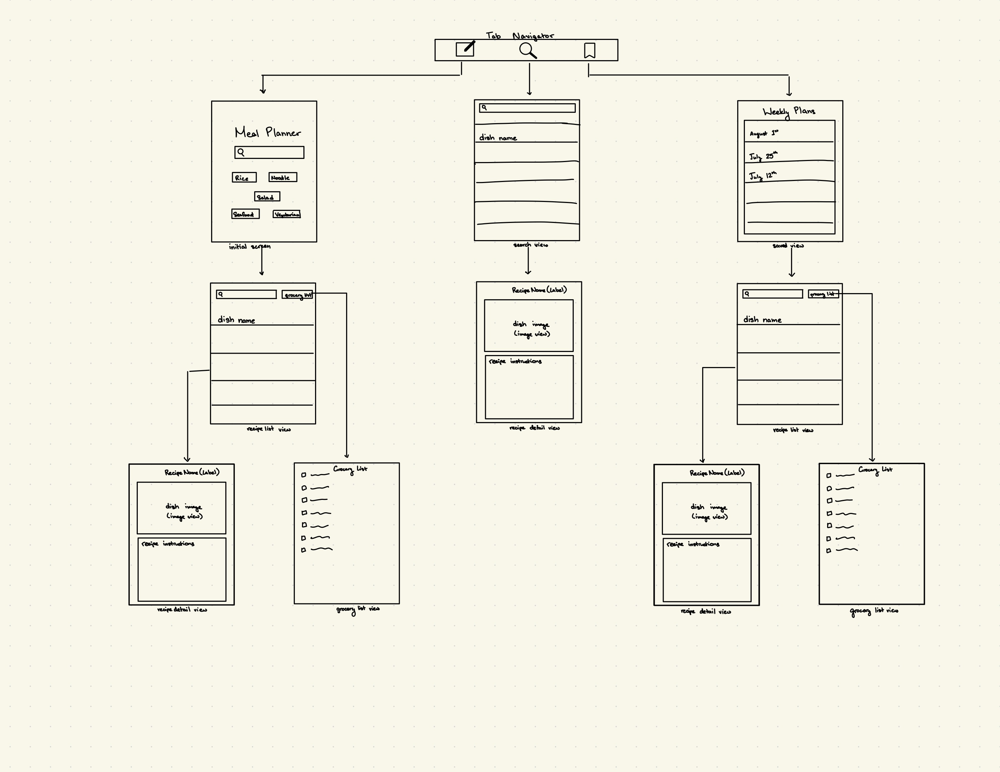

Original App Design Project - README Template
===

# Meal Planner

## Table of Contents

1. [Overview](#Overview)
2. [Product Spec](#Product-Spec)
3. [Wireframes](#Wireframes)
4. [Schema](#Schema)

## Overview

### Description

Allows users to plan their weeks worth of food based on categories they select. The app will then create a randomized list of recipes, which all have similar ingredients. These ingredients will also be presented as a grocery list to make the trip to the store easier.

### App Evaluation

- **Category:** Health 
- **Mobile:** Mobile provides users with easy of use as the grocery list generated would automatically be on their phones. The camera is also essential a it could be used to find recipes based on picuter ingredients.
- **Story:** This app is useful as many people struggle to decide what to make everyday. Through this app they will be able to plan out a few meals, which brings a new variety to their food.
- **Market:** The general public. College students or people who can't figure out what to make on the daily.
- **Habit:** Users would use this once or twice a week to figure out a meal plan for the week and what groceries to buy. They would then use it daily to look at the recipes. 
- **Scope:** Version 1 comes with category buttons. Upon pressing the button, you would be provided a list of recipes from which you would be able to choose from and get the instructions for. Version 2 would include more categories and have the ablitity to include a selection of multiple categories. Version 3 would be where the user selects their categories and gets the list of recipes with similar ingredients, as well as a grocery list. Version 4 includes a list of recipes that the user can choose from, separate from the already curated recipe list in case there are recipes they do not want, as well as being able to add their own recipes. Version 5 implements the ability to take a picture of ingredients and finding a recipe to make. It is likely that the product I will able to finish by the deadline is version 3. 

## Product Spec

### 1. User Stories (Required and Optional)

**Required Must-have Stories**

* Buttons with common categories
* Finds recipes based on categories
* Creates a grocery list based on the recipes
* User must be able to see recipes and ingredients needed
* Users must be able to save the weekly plan

**Optional Nice-to-have Stories**

* User can add their own recipes
* User can take a picture of ingredients to get a recipe
* User can choose which recipes based on the a given list of recipes 

### 2. Screen Archetypes

-  [ ]Stream
    - [ ] User choose which categories for meals
    - [ ] User sees list of recipes
    - [ ] User can see saved lists
- [ ] Detail
    - [X] User can see recipe instructions
    - [ ] User can see list of groceries
- [ ] Creation
    - [ ] User can create recipe

### 3. Navigation

**Tab Navigation** (Tab to Screen)

* Makes randomized list
* User can search for recipes
* User can see their saved lists

**Flow Navigation** (Screen to Screen)

- [ ] Choose different catergories
    * Goes to list of recipes
        * Can see list of groceries 
        * Can see recipe instructions upon selecting recipe

- [ ] Can search for recipes
    * Goes to list of recipes
        * Can see recipe instructions
- [ ] Can see saved plans
    * Goes to list of recipes
        * Can see list of groceries
        * Can see recipe instructions upon selection

## Wireframes

### [BONUS] Digital Wireframes & Mockups

### [BONUS] Interactive Prototype

## Schema 

[This section will be completed in Unit 9]

### Models

[Add table of models]

### Networking

- [Add list of network requests by screen ]
- [Create basic snippets for each Parse network request]
- [OPTIONAL: List endpoints if using existing API such as Yelp]
